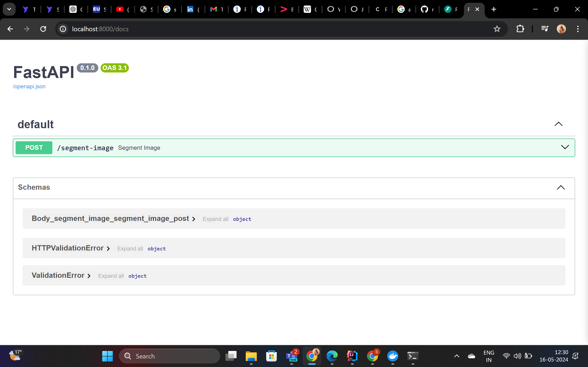

# MobileSAM API

This project provides a FastAPI-based microservice for segmenting images using the MobileSAM model. It is containerized using Docker and can be deployed on Google Cloud Platform (GCP) with Kubernetes.

## Table of Contents

- [Prerequisites](#prerequisites)
- [Setup](#setup)
    - [Local Setup](#local-setup)
    - [Docker Setup](#docker-setup)
    - [Deploying to GCP](#deploying-to-gcp)
- [Usage](#usage)
    - [API Endpoints](#api-endpoints)
- [Testing](#testing)
- [Contributing](#contributing)
- [License](#license)

## Prerequisites

Before you begin, ensure you have the following installed on your machine:

- Python 3.9+
- Docker
- Google Cloud SDK(Optional)
- Kubernetes CLI (`kubectl`)(Optional)

## Setup

### Local Setup

1. **Clone the repository:**

    ```sh
    git clone https://github.com/treesamariaantony/mobilesam-task.git
    cd mobilesam-task
    ```

2. **Create and activate a virtual environment:**

    ```sh
    python -m venv venv
    source venv/bin/activate  # On Windows use `venv\Scripts\activate`
    ```

3. **Install dependencies:**

    ```sh
    pip install -r requirements.txt
    ```

4. **Run the FastAPI application:**

    ```sh
    uvicorn app:app --host 0.0.0.0 --port 8000
    ```

   Your application should now be running at `http://localhost:8000`.

   
### Docker Setup

1. **Build the Docker image:**

    ```sh
    docker build -t segmented_image:latest .
    ```

2. **Run the Docker container:**

    ```sh
    docker run -d -p 8000:8000 segmented_image:latest
    ```

   Your application should now be running at `http://localhost:8000`.
   


### Deploying to GCP

1. **Authenticate with Google Cloud:**

    ```sh
    gcloud auth login
    gcloud config set project YOUR_PROJECT_ID
    ```

2. **Build and push the Docker image to Google Container Registry (GCR):**

    ```sh
    docker tag segmented_image:latest gcr.io/YOUR_PROJECT_ID/segmented_image:latest
    docker push gcr.io/YOUR_PROJECT_ID/segmented_image:latest
    ```
   


3. **Create a Kubernetes cluster:**

    ```sh
    gcloud container clusters create task --zone us-central1 # Cluster name : task
    gcloud container clusters get-credentials task --zone us-central1
    ```

4. **Deploy to Kubernetes:**

   ```sh
   kubectl apply -f deployment.yaml
    ```
   Your application should now be accessible at the external IP address on port 8000.
   


## Usage

### API Endpoints

#### Segment Image

- **URL:** `/segment-image`
- **Method:** `POST`
- **Content-Type:** `multipart/form-data`
- **Body:**
    - `file`: The image file to be segmented.


- **Response:**
    - **Success:**
        - **Code:** `200 OK`
        - **Content:** Returns the segmented image file as a PNG.
    - **Client Errors:**
        - **Code:** `400 Bad Request`
        - **Detail:** "Invalid image file: {error_message}"
            - This error occurs when the uploaded file is not a valid image.
    - **Server Errors:**
        - **Code:** `500 Internal Server Error`
        - **Detail:** "Segmentation failed: {error_message}"
            - This error occurs when the segmentation process fails.
        - **Detail:** "Failed to save segmented image: {error_message}"
            - This error occurs when saving the segmented image to disk fails.
#### Example Request

```sh
curl -X POST "http://localhost:8000/segment-image" -H "accept: application/json" -H "Content-Type: multipart/form-data" -F "file=@dog.jpg;type=image/jpeg"
```


### Testing
## Using Swagger UI
To test the endpoint, open your browser and navigate to http://localhost:8000/docs.
You will see the Swagger UI interface, Here:

- Click on the endpoint and then on the `Try it out` button.
- After this upload the image that has to be segmented, in the `file`.
- After the execution of the endpoint, the image can be downloaded by clicking on the `download file` button. 
